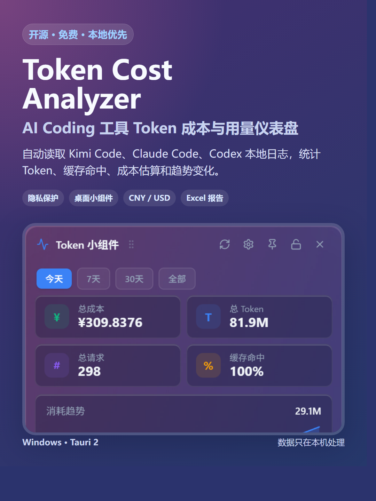
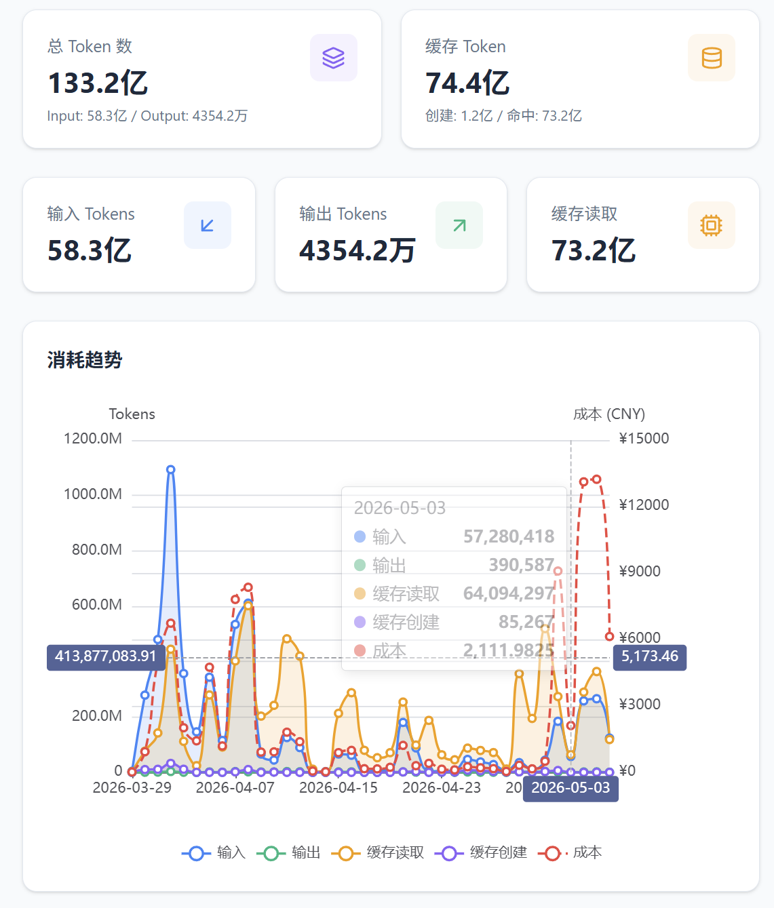
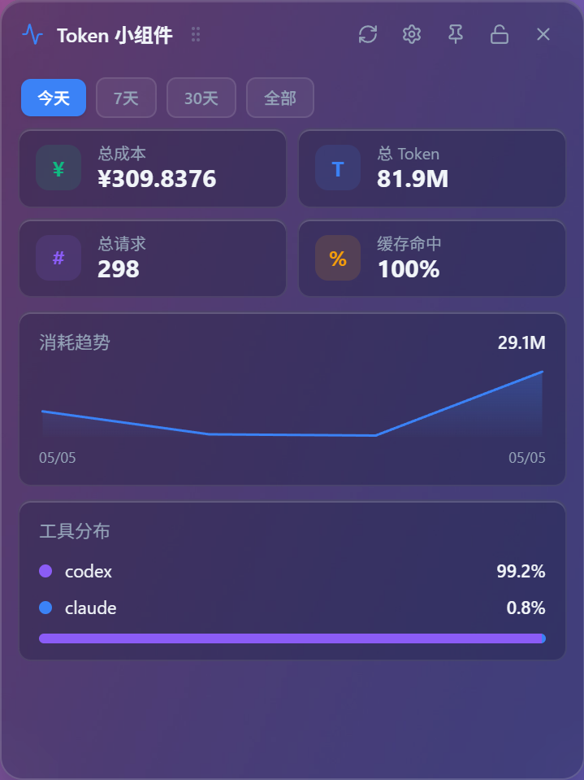
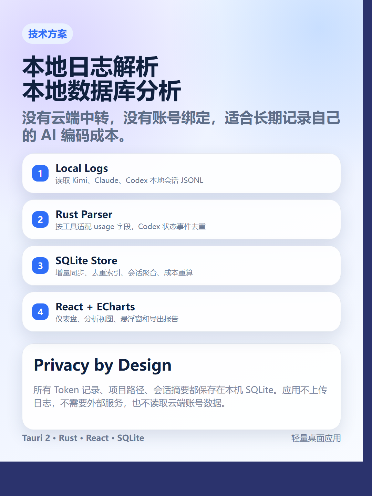
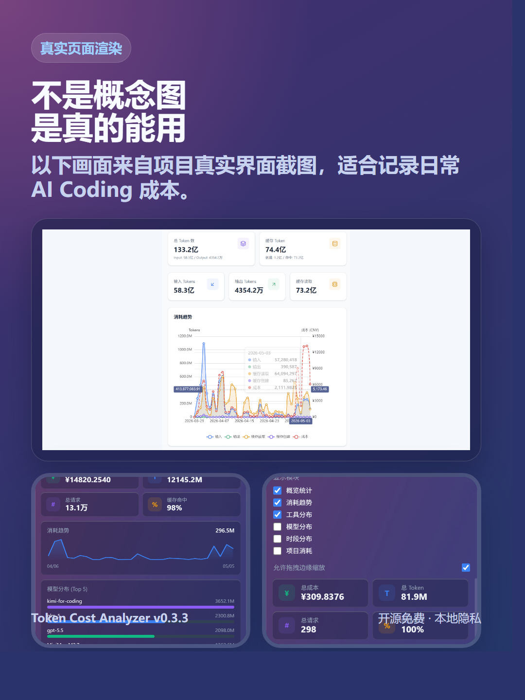
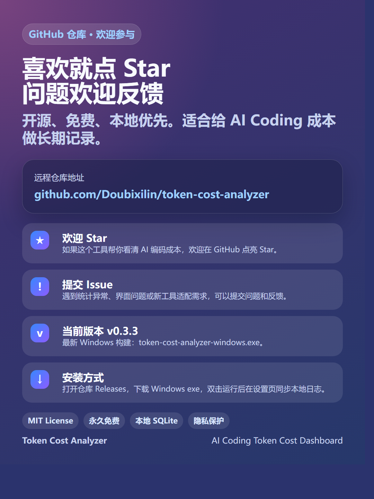

# Token Cost Analyzer



**Token Cost Analyzer** is a free and open-source desktop app for tracking AI coding assistant token usage and estimated cost. It reads local session logs from **Kimi Code**, **Claude Code**, and **Codex**, then turns them into dashboards, charts, exportable reports, and a desktop floating widget.

**开源、免费、本地优先的 AI Coding Token 成本分析工具。** 支持读取 **Kimi Code**、**Claude Code**、**Codex** 本地会话日志，自动统计 Token 用量、缓存命中、成本估算、趋势图表、导出报告，并提供桌面悬浮小组件。

> Cost numbers are estimates for reference only. Actual billing depends on each provider's invoice and pricing rules.
>
> 成本仅为估算值，用于参考；实际费用请以各平台账单和官方定价为准。

---

## Highlights / 功能特点

- **Local privacy first / 本地隐私优先**: reads local logs and stores analysis in local SQLite. No cloud upload, no external account, no telemetry.
- **Multi-tool support / 多工具支持**: Kimi Code, Claude Code, and Codex.
- **Accurate incremental sync / 增量同步**: scans changed session files and deduplicates repeated Codex token status events.
- **Cost display / 成本显示**: model prices are maintained in USD per 1M tokens; the UI defaults to CNY display and can switch to USD. The USD/CNY exchange rate is editable in Settings.
- **Dashboard and analytics / 仪表盘与分析视图**: token totals, cache tokens, model/source distribution, trend charts, heatmap, scatter plot, cumulative cost, Sankey flow, and Top-N ranking.
- **Floating widget / 桌面小组件**: transparent/glass mode, dark mode, resizable mode, draggable floating window, and desktop pinning on Windows.
- **Export / 导出**: CSV, JSON, and Excel analysis report.
- **Free and open source / 开源免费**: MIT licensed.

---

## Screenshots / 截图

| Dashboard / 仪表盘 | Floating Widget / 小组件 |
|---|---|
|  |  |

Xiaohongshu / 小红书 promo cards:

| Overview | Features | Technical Design |
|---|---|---|
|  |  |  |

| Real UI | GitHub / Install |
|---|---|
|  |  |

---

## Download / 下载

Portable Windows build:

- [`releases/token-cost-analyzer-windows.exe`](releases/token-cost-analyzer-windows.exe)
- Latest version / 当前最新版本: **v0.3.3**
- Repository / 远程仓库: <https://github.com/Doubixilin/token-cost-analyzer>

Or download from the GitHub Releases page if a packaged release is published:

- <https://github.com/Doubixilin/token-cost-analyzer/releases>

---

## Supported Data Sources / 支持的数据源

| Tool | Local source | Parsed data |
|---|---|---|
| Kimi Code | `~/.kimi/sessions/**/wire.jsonl` | `StatusUpdate` token usage |
| Claude Code | `~/.claude/projects/**/*.jsonl` | assistant message `usage` |
| Codex | `~/.codex/sessions/**/rollout-*.jsonl` | `session_meta`, `turn_context`, `token_count` |

The app reads local JSONL files, writes normalized records to SQLite, and rebuilds summaries after sync.

应用读取本地 JSONL 日志，将标准化后的记录写入 SQLite，并在同步后重建会话汇总数据。

---

## Technical Design / 技术方案

```text
Local AI tool logs
  -> Rust parsers
  -> SQLite token_records / session_summary / model_pricing
  -> React + ECharts dashboard
  -> CSV / JSON / Excel export + desktop widget
```

- **Desktop shell**: Tauri 2 + Rust
- **Frontend**: React 19 + TypeScript + Vite 7
- **Charts**: ECharts 6
- **State**: Zustand
- **Database**: SQLite via `rusqlite`
- **Widget**: Tauri Webview window with transparent/glass styling and Windows desktop pinning helpers

Key implementation notes:

- Codex parser uses `total_token_usage` signatures to skip repeated status events.
- Timestamps preserve milliseconds to reduce accidental duplicate merging.
- Model pricing is stored in USD per 1M tokens; display currency is a UI preference.
- Cost display defaults to CNY with editable `USD/CNY` exchange rate and date.

---

## Privacy / 隐私保护

Token Cost Analyzer is designed as a local-first tool:

- No backend service is required.
- No session logs are uploaded.
- No project paths or usage summaries are sent to any third party by the app.
- The database is stored locally in the app data directory.
- Exports are generated locally in your browser/WebView.

本项目默认本地运行、本地分析、本地存储：不需要账号、不需要云端服务、不上传日志、不遥测。项目路径、会话摘要、Token 记录和成本估算都保存在本机 SQLite 中。

---

## Usage / 使用方法

1. Install and run the app.
2. Click **Refresh / Sync** to scan local Kimi Code, Claude Code, and Codex logs.
3. Use filters to review usage by time range, source, model, project, or agent type.
4. Open **Settings** to adjust model prices, display currency, USD/CNY exchange rate, and floating widget behavior.
5. Use **Analytics** to export an Excel report, or use Dashboard export for CSV/JSON.
6. Enable the floating widget for quick desktop monitoring.

---

## Build From Source / 从源码构建

Requirements:

- Node.js
- Rust
- Tauri prerequisites for your OS

```bash
git clone https://github.com/Doubixilin/token-cost-analyzer.git
cd token-cost-analyzer
npm install

# Development
npm run tauri dev

# Portable release executable
npm run tauri build -- --no-bundle

# Full bundle, such as NSIS on Windows
npm run tauri build
```

Do not run `cargo build --release` directly for the desktop app; Tauri needs the frontend build and app configuration.

---

## Local Data Location / 本地数据位置

| Platform | SQLite path |
|---|---|
| Windows | `%APPDATA%/com.asus.token-cost-analyzer/token_analyzer.db` |
| macOS | `~/Library/Application Support/com.asus.token-cost-analyzer/token_analyzer.db` |

---

## Version / 版本

Current version: **v0.3.3**

Main updates:

- Desktop floating widget transparency, dark mode, resizable mode, and position preservation.
- CNY/USD display settings with editable exchange rate.
- Codex token count deduplication and millisecond timestamp precision.
- Excel report consistency improvements.
- Bilingual README and 小红书 promotional assets.

---

## License / 许可

MIT License. Free for personal and commercial use.

MIT 许可。可免费用于个人和商业场景。
